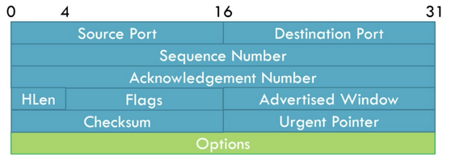
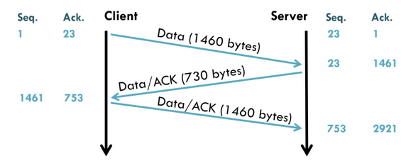
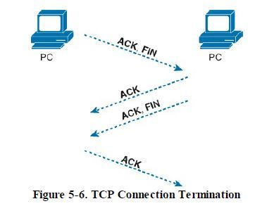
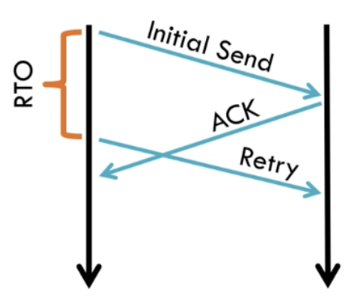
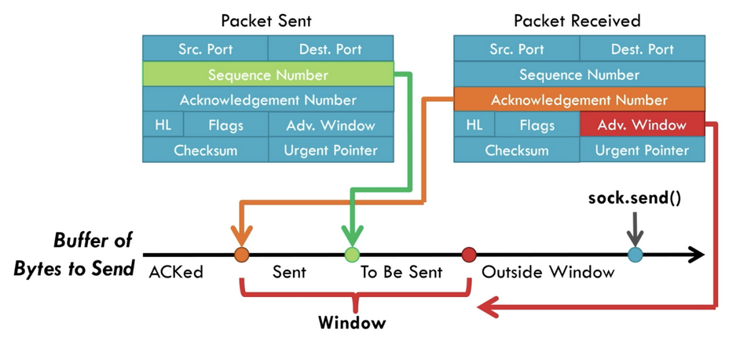

# TCP (Transmission Control Protocol)

Table of Content:
- What is TCP?
- Key Features of TCP
- TCP Header
- TCP Handshake
- TCP Data Transfer
- TCP Teardown
- How In-order Transmission Is Guaranteed
- Flow Control
- Congestion Control

## What is TCP?
- Transport layer protocol that runs on top of IP protocol. It is designed to provide reliable, in-order, error-checked delivery of data between two hosts over an IP network
- Built in 1974 to describe a protocol for sharing resources on a packet-switched network (layer 2 concept)
- Since IP makes no guarantees of how packets are sent from one host to another, TCP aims to provide key features detailed below to allow effective communication between hosts
- Think about IP as a mail route. It only defines the route and addresses of where packets should go, but without a mailman these packets will never get to the desired place in the right order. TCP acts as a sort of mailman making sure that all the packets get delivered to the desired place in the right order and no mail is missing.

## Key Features of TCP
- Reliable Delivery where all the packets are sent in order. Any lost packets will be retransmitted back to receiver
- Flow control to prevent receiver from being overwhelmed by too many senders
- Congestion control to prevent packet loss and maintain network stability
- Guarantees in order delivery. Imagine an online game where the player does a set of commands. These commands should go in the same order as the gamer inputs it.     

## TCP Header

**Source/Destination Port:** These are the ports on the source and destination machines. Reminder that the IP is already provided by the IP header, but even with the IP, the OS uses ports to multiplex different conversations on the same machine. Usually ports 0-1023 are reserved for custom TCP protocols and some OSes will not allow you use them. 1024-49151 are meant for officially registered protocols and 49152-65535 are meant for temporary connections. It is generally suggested to use ports like 5000, 8000, 8080, or 40,000+ for custom protocols.  

**Sequence Number:** Indicates the byte number of the first data byte in the segment relative to the start of the connection. The sequence number serves two roles.  A better description of how the sequence number is used is provided in the TCP handshake section.
1. SYN flag = 1 then this is the initial sequence number. The sequence number is chosen randomly and from there it increments by the number of data sent. The sequence number of the actual first data byte and the acknowledged number in the corresponding ACK are then this sequence number plus 1. 
2. SYN flag = 0 then this is the accumulated sequence number of the first data byte of this segment for the current session  

**Acknowledgement Number:** This also has two different modes. Similarly, a better explanation of the Acknowledgement Number will be given in the TCP Handshake section.
- ACK bit = 1: The acknowledgement number is valid. Basically, it says I have received all bytes up to (Acknowledgement Number - 1), and I am expecting (Acknowledgement Number) of bytes next. For example, if the Acknowledgement Number was 501 then 500 bytes were received and expects to receive 501 bytes next time. 
This is useful for detecting duplicate, out of order packets, and missing packets
- ACK bit = 0: The acknowledgement number is invalid and shouldn't be considered  

**HLen (Header Length):** This is default set as 20 bytes, but it can be larger depending on how many options are set. The minimum length is 20 bytes and maximum is 60 bytes

**Reserved Bits:** Not seen in the diagram and simply merged with flags there are 8 reserved bits that follow HLen. These are usually set to 0 and ignored by sender and receiver, but might be officially used in the future

**Flags:**
- CWR (1 Bit): Congestion Window Reduced flag is set to acknowledge that it reduced its congestion window after receiving an ECE
- ECE (1 Bit): Is the ECN-Echo bit, and it is used by receiver to echo back congestion notifications to the sender. Basically tells sender there is congestion in network right now.
- URG (1 Bit): Indicates Urgent Pointer is valid
- ACK (1 Bit): Indicates that there should be Acknowledgement
- PSH (1 Bit): Indicates to receiver that the sender wants the data immediately and not buffered. This doesn't affect fairness in anyway. Suppose a situation where a sender sends a lot of small packets to a receiver. Instead of instantly replying with small packet responses, the sender chooses to buffer packets and send one big reply. If the sender doesn't want this to occur, then the sender can set the PSH bit = 1, which tells the receiver that it would prefer an instant response and have the responses not be buffered. Keep in mind that this bit is just a HINT and not a command. Most TCP stacks wil respect the hint, but it is possible as with all the bits to ignore it.
- RST (1 Bit): Resets the connection and discards queued data. This happens when say you are watching a Youtube video but close the tab mid stream. Instead of using the FIN bit to gracefully close the connection, the browser can set the RST bit to 1 and this tell the server that it can immediately drop the connection.
- SYN (1 Bit): Indicates to use the synchronization number
- FIN (1 Bit): Indicates last packet from sender

**Advertised Window:** The advertised window is important for flow control. This is basically set by the receiver to tell senders how many bytes the receiver is willing to receive, and it protects the receiver from being overloaded.

**Checksum:** Serving a similar task in the physical layer, this serves as a error checking for the TCP header, payload, and IP pseudo-header (source/dest IP and TCP protocol number). If the checksum fails then the receiver can discard the TCP packet silently.

**Urgent Pointer:** If the URG flag is set, then the field is used for an offset from the sequence number indicating the last urgent data byte. Frankly, it is rarely used today, but basically it would say that the data from the last updated byte till now is urgent and should be delivered as fast as possible.

**Options:** The length of options is determined by HLen and any unused options are padded with 0. Options are split into 3 different fields.
- Option-Kind (1 byte) = Indicates the type of option and is the only field that is not optional
- Option-Length (1 byte) = Depending on Option-Kind this has to be set. Indicates the total length of the option
- Option-Data = Depending on Option-Kind this has to be set. Contains data associated with the option

## TCP Handshake

**SeqS and SeqC are random numbers**  
1. Client sends TCP Packet SYN<SeqC, 0> to Server
2. Server responds SYN/ACK<SeqS, SeqC+1>
3. Client responds ACK<SeqC+1, SeqS+1>

### Understanding TCP Handshake
Let's dissect what this handshake means. Note that no "useful" data is sent over yet. This is merely for establishing a connection between a client and a host. The actual transfer of data between client and host is during data transfer step

First, the client wants to establish a connection with the Server, so the client needs to set up a TCP packet. The clients TCP header must set the SYN flag to 1 and a sequence number denoted as SeqC to a random number. The client can then send it over to the server over the network layer.

When the server receives the client packet, the server will also generate a random sequence number denoted as SeqS. It will then send a SYN/ACK response to the client with +1 added to SeqC in the acknowledgement number. By sending SeqC in the acknowledgement number the server tells the client that it agrees with the client's sequence number and needs to send its own sequence number. The +1 added to SeqC is quite random. It's intended use is that flags are treated as a byte, but it doesn't really add anything.

When the client receives SYN/ACK<SeqS, SeqC+1>, there needs to be a final ACK to say that client acknowledges the server's sequence number and agrees with what the server thinks the client sequence number is. This final ACK is necessary as the server doesn't know if the client acknowledges its Sequence number and if both sides are synchronized yet. Once this ACK is sent though both sides are synchronized, and the connection is set to established

### Why use TCP Handshake
- Hard for spoofing IP addresses
Suppose an attacker was using a spoofed IP address. When the attacker sends the SYN Packet to the Server with a spoofed IP address, then the server responds with a SYN/ACK back to the spoofed IP address and not the attacker's IP address. Thus, the attacker can’t send ACK because it didn’t receive SeqS.  
In addition, random sequence numbers makes it hard to establish TCP connection with spoofed client source address in the SYN packet

## TCP Data Transfer

1. Client sends Data Packet <SeqC+1, SeqS+1, LEN> to Server
2. Server responds ACK <SeqS+1, SeqC+1+LEN>
3. Server sends Data Packet <SeqS+1, SeqC+1+LEN, LEN2> to Client
4. Client responds ACK <SeqC+1+LEN, SeqS+1+LEN2>

### Understanding TCP Data Transfer
The process of sending data is a lot simpler than the TCP Handshake and I will quickly go over it.

First, the client wants to send a packet of data to the server. Suppose the packet of data was 1460 bytes as shown in the picture above. The length of the data can be calculated by the expression $(IPLen - IPHeaderLen) - TCPHeaderLen$. The client sends sequence number of SeqC+1 because the data starts 1 byte after the previous sequence number. The acknowledgement number is SeqS+1 because the client knows where the server's sequence number(SeqS) ends, so it expects the next byte at SeqS+1.

When the server receives this message, the server will acknowledge it. The Server acknowledges it received the data by sending its sequence number SeqS+1 which is the first usable byte. Since there is no payload SeqS stays the same. The acknowledgement number is SeqC+1+LEN because SeqC+1 is where the first byte starts and LEN is the length of the payload sent to the server.

Now suppose the server wanted to send a packet to the client as a response. The server needs to start at SeqS+1 because that is the next byte available to send, and sets the acknowledgment number to SeqC+1+LEN. This is because the server wants to also still let the client know that it has received all bits up to SeqC+1+LEN. Let LEN2 just be the payload for the response. Frequently, the ACK and data packet are grouped together, but for this example the 2 steps are separated for understanding the process.

Finally, the client has to acknowledge the packet sent by the server. This is the same process as step 2 of what the server did, but the client is now acknowledging the server.

## TCP Teardown

1. Client sends FIN<SeqC+N, SeqS+M> to server
2. Server sends ACK/FIN<SeqS+M, SeqC+N+1> to client
3. Client sends ACK<SeqC+N+1,SeqS+M+1> to server

### Understanding TCP Teardown
By now, the process of teardown should look very similar to the handshake and data transfer. The point of teardown is to shut the connection, so that the client and server can close their ports independently. Some alternatives to this are both sides send FIN at the same time or one side sends RST and the connection is torn down instantly. 

In all these cases though, the whole point of establishing the connection is over is because the side that did not close should not waste resources retransmitting packets. This is why 2 FINS are used in this process.

The process starts with the client sending FIN to the server. The server acknowledges this FIN and sends its own FIN. The client then needs to send an ACK because the server won't know if the client accepted the server's FIN without it. This allows for a very graceful termination.

## How is in-order transmission guaranteed?
TCP guarantees in-order transmission through tracking the Sequence Number and Acknowledgement Number. By acknowledging the sequence number and how many bytes are received, anything out of order will not make sense. For example consider the case below

Example:
- Client sends Server packet with 1000 bytes and sequence number of 1001 
- Server acknowledges client by sending ACK with acknowledgement number of 2001
- Client sends Server a packet with 1000 bytes and sequence number of 2001 but the packet is dropped
- Client sends Server another packet with 100 bytes and sequence number of 3001
- The Server successfully receives it but sees that the sequence number is incorrect. Server still ACKS, but sends a duplicate ACK with an acknowledgement number of 2001.

If packets arrive out of order (typically due to a dropped packet), the receiver continues acknowledging the last correctly received. Thus duplicate ACKs means receiver did not receive sent data. Thus, if out of order data is sent it will simply not be processed until the correctly ordered packet is sent.

### Why not send huge packets so it is unnecessary to transmit sequential packets?
The answer is that there is  a bandwidth limit or a MSS (Max Segment Size typically 1460 Bytes) for the network, so these huge packets simply cannot be sent. Instead, TCP provides a byte stream abstraction so that data on the application layer is seen as a stream of contiguous bytes and not several packets chunked together. What this means is when a client application wants to write a stream of bytes it can call a write() TCP API function. Then the TCP protocol will go ahead and break or coalesce the bytes into multiple segments to transmit. The receiver doesn't see the packets that come in, but instead, the receiver calls a read() TCP API function to read the bytes that come in as a stream of bytes.

## How is reliabile transmission guaranteed?
Through checksum TCP guarantees that the packets do not come corrupted. In the case that packets are corrupted or packets are dropped, then the sender can retransmit packets to receiver. This type of framework can cause congestion and flow issues if the retransmission are sent too often, and the methods to deal with such issues are detailed in the section Flow Control & Congestion Control.

For in-order packet transmission, sequence numbers catch sequence issues: duplicates ignored, out-of-order reordered, missing seq number indicate lost packet. These sequence numbers are always returned on ACK by the receiver to determine that they have an up to date state of what byte the other party is supposed to send, but sometimes it takes a long time for the receiver to ACK. This can happen for a pletora of reasons like congestion in the network, packet loss, or long distance between the two endpoints. This then begs the question of how long should a sender wait for an ACK before retransmitting?

**When should a sender retransmit?**

The solution is to have a designated time to wait for an ACK before retransmitting. Senders will keep data in the buffer until the data has been ACKed. For example if the sender sends bytes up to 8000 but receiver only ACKs bytes up to 5000 then bytes 5000-7999 still need to be in the sender buffer. The hard part to this is calculating that timeout duration. Usually, the sender measures the round trip time (RTT) or the amount of time it takes from packet being sent out to ACK being received by sender. Using the RTT value, a RTO or Retransmission Timeout can be tuned.

**How RTO is calculated:**

Naturally, TCP cannot set RTO = RTT as it is a single point of data.  The RTT can vary depending on the state of the network and should thus be a constantly changing value. Thus, in RFC 793 (original specification of TCP) a weighted average of RTT is used to calculate RTO. $\alpha$ is a weight suggested to be of value 0.9, and $RTT_{sample}$ is the latest measured RTT. If no RTT value is measured, then the RTO defaults to a value of 1 minute.
$$
\alpha \in [0,1]
$$
$$
RTO \leftarrow \alpha *  RTO + (1-\alpha) * RTT_{sample}
$$
This is a very naive version of RTO estimation, and there has been big improvements in RTO estimation i.e. Jacobsen/Karels algorithm. These improvements and reasoning behind the improvements are highlighted in the paper "Congestion Avoidance and Control" by Jacobsen and Karels.

## Problems with TCP?
**Main Issue:** Congestion control and fairness. These problems will be covered in detail in the next sections. There have been many variants that attempt to solve this issue such as TCP CUBIC and ongoing research is still being done. 

**Issue 2:** The TCP handshake is too slow. This has sparked new TCP variants like TCP Fast Open or QUIC, which will be detailed later.

**Issue 3:** 1 Packet loss blocks all other data. This is due to TCP's in order delivery nature. Say packet 1, 2, and 3 are supposed to be sent in order, but packet 2 is lost along the network. TCP requires that packets 2 and 3 be resent until both are ACKed or the connection is closed.

**Issue 4:** TCP behaves poorly on wireless networks. This is due to the nature of packet loss over wireless networks, and if you haven't read the description of how congestion control is handled, TLDR packet loss is interpreted as congestion control. Thus, you can imagine a situation where the network is in fact not congested but because it is wireless and will drop packets at a higher frequency than suppose Ethernet, TCP will misinterpret this as high congestion in the network thus reducing the throughput of the sender. There have been TCP variants to try and solve for this such as TCP Veno, TCP Westwood, and Split TCP.

**Issue 5:** Middlebox Ossification. Middleboxes are devices that sit between endpoints and monitor or manipulate traffic such as firewalls, NATs, or load balancers. Ossification means “hardening,” and in networking, it refers to the fact that middleboxes often make rigid assumptions about protocol behavior.

The result is that TCP cannot evolve quickly because middleboxes expect headers and options to follow a known format. For example, suppose a firewall only recognizes TCP packets that use well-known options (like those in TCP CUBIC). If say a Duke lab introduce a new TCP variant that reuses reserved bits in the TCP header, many middleboxes will not understand the new fields and may drop or block those packets. This prevents deployment of new TCP extensions in the real Internet, even if they work perfectly in the lab.

## Flow Control
A common issue in networking is determining how much data a sender can transmit to a receiver at once. If multiple senders transmit at their maximum rate, they could easily overwhelm the receiver buffer. Complicating things further, a receiver can dynamically adjust the size of its buffer during an active connection, meaning the amount of data it can accept changes over time.  Note the goal does not include maximizing throughput, but simply to guarantee that the receiver can handle the incoming data without overflow. In contrast, congestion control is concerned with preventing overload in the network itself (e.g., router queues and gateway buffers), where too many senders competing for limited capacity could cause packet loss and long delays.

The solution to Flow Control is a sliding window, and the process can be described below.
- In every TCP ACK, the receiver tells sender how big their buffer is in the Advertised Window (rwnd), denoting how much free space is left. Thus if the Advertised Window is 0 then the buffer is full and the sender should not send anything else
- For window size $n$, sender may transmit $n$ bytes without receiving an ACK. This means that the sender can send multiple packets that have payloads adding up to at most $n$ bytes without a receiver ACK
- After each ACK, the window slides forward. Basically when the receiver sends an ACK it confirms it received the bytes and frees up space in the buffer. This new space is reflected in the next advertised window size.

**Example of Sliding Window:**
 
Suppose the receiver advertises its window was rwnd=5000 in the SYN-ACK of the TCP handshake and the sender's sequence number is at 0. Then the sender can send bytes 0-4999  without receiving another ACK. This would be denoted as the first window. 

Next, the receiver sends an ACK = 3000 & rwnd=5000, saying the receiver got everything up to byte 2999. This frees up 3000 bytes in the receiver and thus the sender can now send bytes from 3000-7999. If the rwnd increased or decrease then the right bound of what byte the sender can send to changes, but because rwnd=5000 then the rightmost byte can only be up to 5000 more than 3000. In short, the left edge of the window increases as bytes are acknowledged, and the right edge also moves forward if the rwnd is above 0.

- ACKed (left of orange) → Data already acknowledged by the receiver and sender can free this space

- Sent (orange) → Data sent but not yet ACKed, so its still in flight. Needs to stay in sender buffer because it hasn't been ACKed and will be retransmitted depending on receiving duplicate ACK or Timeout expiry. Covered more in congestion control

- To Be Sent (green) → Data allowed to be sent (within the advertised window)

- Outside Window (red) → Data beyond the receiver’s advertised window (rwnd), so sender cannot send this until the receiver increases its rwnd

- sock.send() (blue) → Application pushes more data into the send buffer, but that data may or may not fit in the current window

## Congestion Control