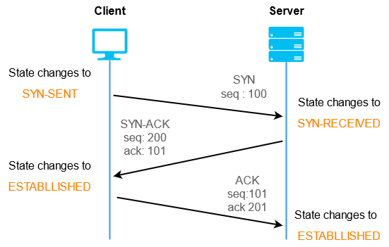

# TCP (Transmission Control Protocol)
## What is TCP?
- Transport layer protocol that runs on top of IP protocol. It is designed to provide reliable, in-order, error-checked delivery of data between two hosts over an IP network
- Built in 1974 to describe a protocol for sharing resources on a packet-switched network (layer 2 concept)
- Since IP makes no guarantees of how packets are sent from one host to another, TCP aims to provide key features detailed below to allow effective communication between hosts
- Think about IP as a mail route. It only defines the route and addresses of where packets should go, but without a mailman these packets will never get to the desired place in the right order. TCP acts as a sort of mailman making sure that all the packets get delivered to the desired place in the right order and no mail is missing.
## Key Features of TCP
-      

## TCP Handshake

**SeqS and SeqC are random numbers**  
1. Client sends TCP Packet SYN<SeqC, 0> to Server
2. Server responds SYN/ACK<SeqS, SeqC+1>
3. Client responds ACK<SeqC+1, SeqS+1>
