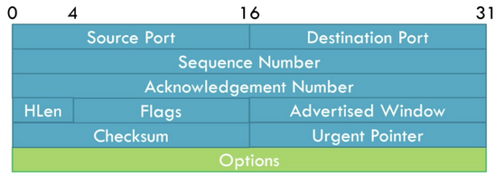

# TCP (Transmission Control Protocol)
## What is TCP?
- Transport layer protocol that runs on top of IP protocol. It is designed to provide reliable, in-order, error-checked delivery of data between two hosts over an IP network
- Built in 1974 to describe a protocol for sharing resources on a packet-switched network (layer 2 concept)
- Since IP makes no guarantees of how packets are sent from one host to another, TCP aims to provide key features detailed below to allow effective communication between hosts
- Think about IP as a mail route. It only defines the route and addresses of where packets should go, but without a mailman these packets will never get to the desired place in the right order. TCP acts as a sort of mailman making sure that all the packets get delivered to the desired place in the right order and no mail is missing.
## Key Features of TCP
-      

## TCP Handshake

**SeqS and SeqC are random numbers**  
1. Client sends TCP Packet SYN<SeqC, 0> to Server
2. Server responds SYN/ACK<SeqS, SeqC+1>
3. Client responds ACK<SeqC+1, SeqS+1>

### Understanding TCP Handshake
Let's dissect what this handshake means. Note that no "useful" data is sent over yet. This is merely for establishing a connection between a client and a host. 

First, the client wants to establish a connection with the Server, so the client needs to set up a TCP packet. The clients TCP header must set the SYN flag to 1 and a sequence number denoted as SeqC to a random number. The client can then send it over to the server over the network layer.

When the server receives the client packet, the server will also generate a random sequence number denoted as SeqS. It will then send a SYN/ACK response to the client with +1 added to SeqC in the acknowledgement number. By sending SeqC in the acknowledgement number the server tells the client that it agrees with the client's sequence number and needs to send its own sequence number.

When the client receives SYN/ACK<SeqS, SeqC+1>, there needs to be a final ACK to say that client acknowledges the server's sequence number and agrees with what the server thinks the client sequence number is.

### Why use TCP Handshake
- Hard for spoofing IP addresses
Suppose an attacker was using a spoofed IP address. When the attacker sends the SYN Packet to the Server with a spoofed IP address, then the server responds with a SYN/ACK back to the spoofed IP address and not the attacker's IP address. Thus, the attacker can’t send ACK because it didn’t receive SeqS.  
In addition, random sequence numbers makes it hard to establish TCP connection with spoofed client source address in the SYN packet

## TCP Header

**Source/Destination Port:** These are the ports on the source and destination machines. Reminder that the IP is already provided by the IP header, but even with the IP, the OS uses ports to multiplex different conversations on the same machine. Usually ports 0-1023 are reserved for custom TCP protocols and some OSes will not allow you use them. 1024-49151 are meant for officially registered protocols and 49152-65535 are meant for temporary connections. It is generally suggested to use ports like 5000, 8000, 8080, or 40,000+ for custom protocols.  
 
**Sequence Number:** Indicates the byte number of the first data byte in the segment relative to the start of the connection. The sequence number serves two roles. 
1. SYN flag = 1 then this is the initial sequence number. The sequence number is chosen randomly and from there it increments by the number of data sent. The sequence number of the actual first data byte and the acknowledged number in the corresponding ACK are then this sequence number plus 1. 
2. SYN flag = 0 then this is the accumulated sequence number of the first data byte of this segment for the current session.  
 
**Acknowledgement Number:** This also has two different modes
- ACK bit = 1: The acknowledgement number is valid. Basically, it says I have received all bytes up to (Acknowledgement Number - 1), and I am expecting (Acknowledgement Number) of bytes next. For example, if the Acknowledgement Number was 501 then 500 bytes were received and expects to receive 501 bytes next time. 
This is useful for detecting duplicate, out of order packets, and missing packets
- ACK bit = 0: The acknowledgement number is invalid and shouldn't be considered  

**HLen (Header Length):** This is default set as 20 bytes, but it can be larger depending on how many options are set. The minimum length is 20 bytes and maximum is 60 bytes

**Reserved Bits:** Not seen in the diagram and simply merged with flags there are 8 reserved bits that follow HLen. These are usually set to 0 and ignored by sender and receiver, but might be officially used in the future

**Flags:**
- CWR (1 Bit): Congestion Window Reduced flag is set to acknowledge that it reduced its congestion window after receiving an ECE
- ECE (1 Bit): Is the ECN-Echo bit, and it is used by receiver to echo back congestion notifications to the sender. Basically tells sender there is congestion in network right now.
- URG (1 Bit): Indicates Urgent Pointer is valid
- ACK (1 Bit): Indicates that there should be Acknowledgement
- PSH (1 Bit): Indicates to receiver that the sender wants the data immediately and not buffered. This doesn't affect fairness in anyway. Suppose a situation where a sender sends a lot of small packets to a receiver. Instead of instantly replying with small packet responses, the sender chooses to buffer packets and send one big reply. If the sender doesn't want this to occur, then the sender can set the PSH bit = 1, which tells the receiver that it would prefer an instant response and have the responses not be buffered. Keep in mind that this bit is just a HINT and not a command. Most TCP stacks wil respect the hint, but it is possible as with all the bits to ignore it.
- RST (1 Bit): Resets the connection and discards queued data. This happens when say you are watching a Youtube video but close the tab mid stream. Instead of using the FIN bit to gracefully close the connection, the browser can set the RST bit to 1 and this tell the server that it can immediately drop the connection.
- SYN (1 Bit): Indicates to use the synchronization number
- FIN (1 Bit): Indicates last packet from sender

**Advertised Window:** The advertised window is important for flow control. This is basically set by the receiver to tell senders how many bytes the receiver is willing to receive, and it protects the receiver from being overloaded.

**Checksum:** Serving a similar task in the physical layer, this serves as a error checking for the TCP header, payload, and IP pseudo-header (source/dest IP and TCP protocol number). If the checksum fails then the receiver can discard the TCP packet silently.

**Urgent Pointer:** If the URG flag is set, then the field is used for an offset from the sequence number indicating the last urgent data byte. Frankly, it is rarely used today, but basically it would say that the data from the last updated byte till now is urgent and should be delivered as fast as possible.

**Options:** The length of options is determined by HLen and any unused options are padded with 0. Options are split into 3 different fields.
- Option-Kind (1 byte) = Indicates the type of option and is the only field that is not optional
- Option-Length (1 byte) = Depending on Option-Kind this has to be set. Indicates the total length of the option
- Option-Data = Depending on Option-Kind this has to be set. Contains data associated with the option

