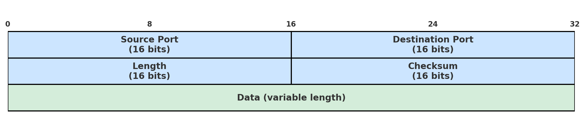

# UDP (User Datagram Protocol)

Table of Content:
- What is UDP?
- Key Features
- UDP Header
- Protocol Description

## What is UDP?
UDP is the second core transport layer protocol that is connectionless, fast, and lightweight. What is meant by connectionless is unlike TCP the UDP protocol merely needs a sender to declare destination IP and the protocol will send the packet. The receiver at the destination should be listening at the port, but if the packet is lost or is damaged the receiver doesn't try to send it back. While there is no guarantee that the message will be sent to the upper layers correctly, UDP does use checksum to ensure the integrity of the header and payload.

## Key Features
- Connectionless
- Unreliable Delivery
- No packet ordering
- No Congestion Control
- Lightweight

## UDP Header

**Source/Destination Port:** These are the ports on the source and destination machines. Reminder that the IP is already provided by the IP header, but even with the IP, the OS uses ports to multiplex different conversations on the same machine. Usually ports 0-1023 are reserved for custom TCP protocols and some OSes will not allow you use them. 1024-49151 are meant for officially registered protocols and 49152-65535 are meant for temporary connections. It is generally suggested to use ports like 5000, 8000, 8080, or 40,000+ for custom protocols.  

**Length:** This field specifies the length in bytes of the datagram in octets with a minimum of 8 bytes (the header length) and a theoretical max of 65,527 bytes. IPv4 specifies however that the max is 65,507 bytes, but IPv6 specifies that the max is 65,535 bytes. While IPv6 is the most recent standard, it is standard to stay less than IPv4.

**Checksum:** Serving a similar task in the physical layer, this serves as a error checking for the UDP header, payload, and IP pseudo-header (source/dest IP and TCP protocol number). This is optional in IPv4 as the network layer already does a header checksum as well but mandatory in IPv6 as there is no longer a header checksum in the network layer.

## Protocol Description
There isn't an in depth protocol like what TCP has. Instead, for UDP the sender merely has to create a UDP socket, Send message to destination IP, and close the socket when done. As you can see the sender does not care if the receiver sends a message back in UDP and only binds to a port if the sender expects to receive something back, which is not specified by the UDP protocol.