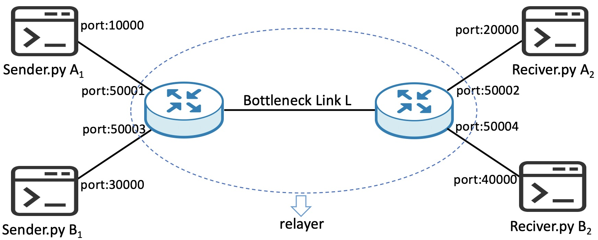

# Lab 1 - Congestion Control

CompSci 514/ECE 558 Advanced Computer Networks, Fall 2025

## Introduction

You will design and implement a reliable transport protocol based on UDP.
We have already provided the reliability part of the protocol.
You main task is the congestion control algorithm.
However,
feel free to redesign the reliability part if you would like.

You are provided with a link emulator binary (`relayer`),
a large file generator binary (`generator`),
a receiver binary (`Receiver`),
and a Python sender framework (`Sender.py`, `Reliable.py`, `ReliableImpl.py`, `Congestion.py`, and `Util.py`).
To complete this lab,
you only need to implement the functions in `Congestion.py`,
but you may need to read and understand other Python code.
We have also included a grading script (`grader.py`),
free of charge,
which will be used by the autograder.

## Prerequisite

- Operating system: Ubuntu 22.04
- Programming language: Python 3

Here are some resources at Duke that provides Ubuntu 22.04:

- [Duke OIT](https://vcm.duke.edu/)
- [Duke CS cluster](https://computing.cs.duke.edu/)

Run the following commands to install required packages:

```
$ sudo apt update
...
$ sudo apt install gcc make net-tools python3 python3-pip screen
...
```

## Network Topology



$A_1$ sends $\text{file}\_1$ to $A_2$.
$B_1$ sends $\text{file}\_2$ to $B_2$.
Both $\text{file}\_1$ and $\text{file}\_2$, can be generated by generator.
These connections share the bottleneck link $L$,
which is emulated by the relayer we provide.
You are required to implement a congestion control algorithm that efficiently and fairly utilizes the capacity of $L$.
In this lab,
the senders, receivers, and the relayer are running on a single machine.
They communicate using the IP address 127.0.0.1 (localhost).

## Get Started

### Generate large files

Run following command to generate a file of arbitrary size.

```
$ ./generator [file size in byte] [file name]
```

### Configure the network topology

The relayer emulates the bottleneck link $L$ and the gateway routers.
The provided `config.xml` sets up the 2:2 dumbbell topology used by the autograder.
You can adjust the following parameters in `config.xml`:

- `number_of_pairs`: The number of sender-receiver pairs this link can support in the dumbbell topology.
- `propagation_delay`: The propagation delay of bottleneck link $L$.
- `bandwidth`: The bandwidth (kbit/s) of the bottleneck link $L$. We recommend you configure the link capacity to be less than 20000 (kbit/s) for more accurate emulation results.
- `buffer_size`: The buffer size of the gateway routers. Packets from a sender to a receiver will first wait in this buffer and then get transmitted through link $L$. When the buffer is full, the router begins discarding packets using the FIFO policy. As a rule of thumb, set the buffer size to the bandwidth-delay product.
- `pair`: This parameter specifies the incoming IP/port numbers of a sender/receiver, and the relaying ports. For instance, in the topology shown above, the sender A1 is running on port 10000, and the receiver A2 is running on port 20000. The relayer is running on port 50001 to receive packets from A1. It may delay or discard packets from A1 based on its buffer status, and then send these packets via port 50002 to the receiver A2. Similarly, ACK packets from A2 will be relayed via the relayer back to A1. Note that the relayer will not drop ACK packets.

### Start the relayer

Run the following command in a terminal to start the relayer (the gateway routers and the bottleneck link $L$):

```
$ ./relayer config.xml
```

### Start the receivers

Run the following command in another terminal to start Receiver $A_2$:

```
$ ./Receiver temp1.txt -p 20000
```

Run the following command in another terminal to start Receiver $B_2$:

```
$ ./Receiver temp2.txt -p 40000
```

### Start the senders

Run the following commands in two other terminals to start Senders $A_1$ and $B_1$:

```
$ python3 Sender.py file1.txt -p 10000 -r 50001
```

```
$ python3 Sender.py file2.txt -p 30000 -r 50003
```

If the above commands do not work,
do not worry.
Read the next section,
complete `Congestion.py`,
and then come back.

## Implementation

In `Congestion.py`,
you will see two empty functions `updateCWND()` and `updateRTO()`.
You task is to complete these to functions to implement the congestion control.

### updateCWND()

The arguments of `updateCWND()` are the instances of the reliable connection `reli` and `reliImpl`,
and three flags (`acked`, `timeout`, and `fast`).

The function `updateCWND()` will be invoked each time a new packet is acked (`acked` is `True`),
a packet is considered timeout (`timeout` is `True`),
or more than three duplicated acked packets are received (fast retransmission, `fast` is `True`).
Update the CWND by assigning values to `reli.cwnd`.
You are also allowed to modify the other values in `reli` if it is helpful.

### updateRTO()

The function `updateRTO()` will be invoked each time when a non-retransmitted packet is acked.
The arguments include `reli`, `reliImpl`, and the timestamp when the packet is sent out.
Update the RTO by assigning values to `reliImpl.rto`.
You are also allowed to modify the other values in `reliImpl` if it is helpful.

### Notes

Besides `Congestion.py`,
you can also modify `ReliableImpl.py` and `Util.py` if you believe that it will help you score higher in the auto grader more easily.

Note that the autograder grades your implementation using the `Sender.py`,
`Reliable.py`,
and `grader.py` we give you.
Hence,
modifying `Sender.py`,
`Reliable.py`,
or `grader.py` only helps you debug.

## Autograder

The autograder uses the script `grader.py` to grade your submission.
Feel free to test your code before submission.
To use `grader.py`,
you do not need to run the other programs
(`Sender.py`, `Receiver`, or `relayer`).
The autograder will automatically run those components.
Just run the command:

```
$ python3 grader.py
Running Python code ...
Case 1: ...
Bandwidth: ...
Points: 10/10
...
Case 10: ...
Fairness : ...
Points: 10/10
Total: 100/100
```

The autograder will test 10 cases for your code.
Each case accounts for 10 points.
The test cases are divided into two groups.
The first group includes 5 test cases for bandwidth utilization.
The second groups includes 5 test cases for fairness.

### Bandwidth

For bandwidth utilization,
the grader only runs one sender-receiver pair,
and computes the average throughput during the transmission.
For each case in bandwidth utilization,
let the bandwidth in a test case be $B$, and the throughput of your implementation be $x$.
Then your will get the points $f(x)$ for this case according to the following equation.

$$
f(x)= 10 \frac{\min (x, 0.85 B)}{0.85B}
$$

### Fairness

For fairness,
the grader runs two sender-receiver pairs as shown in our topology.
It uses Jain's fairness index to measure the fairness.
Let the fairness index of your code be $x$.
Your points $f(x)$ will be as follows:

$$
f(x)= 10 \frac{\min (x-0.5, 0.95 - 0.5)}{0.95 - 0.5}
$$

### Notes

For accuracy,
the grader will keep running for a while.
It sometimes requires up to 15 minutes to complete all test cases.
Thus,
please be patient and start early.
You can use the `-t` option to run a specific test case.
For example,
run `python3 grader.py -t 3` to test your code against Case 3.

## Submit to Gradescope

Submit your code to Gradescope,
which will grade your code automatically.
Your submission should include `ReliableImpl.py`, `Congestion.py`, `Util.py` and any extra files your program need.
We will use the original `grader.py`, `Sender.py`, `Reliable.py`, and `Receiver` to grade your code.
You can submit your code for an unlimited number of times.
The autograder generates a directory `data/` with super large files while running.
Please do NOT submit the `data/` directory to avoid taking up too much space.

You must finish this lab individually.
It is okay to discuss high-level concepts with people you trust,
but please do not look at other students' solutions.
