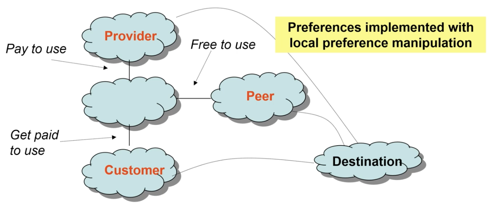
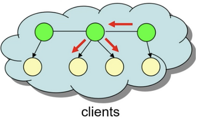

# Inter-Domain Routing Protocol (BGP)
## Terms
Routing = Finding a path from a source and destination without loops. Can be also called process of learning which next hop to forward a packet

Route = a network prefix + path attributes

Transit Service = If A advertises a route to B, it implies that A will forward packets coming from B to any destination in the advertised prefix

Advertisement = BGP router saying I can reach this IP prefix. This is the route and policies for sending stuff there

Control Plane = Decides how a packet should be forwarded (builds routing table)

Data Plane = Moves packets from source to dest (uses routing tables)
 
Background:
- Expensive Routers to communicate outside of an AS and switches are used inside
- 152.3.0.0/16 means the IP prefix is 16 bits long
- Routers exchange routing protocol messages to building routing table
- IP Prefixes and ASNs are seperately registered
- 1GB = 1000 MB = 1,000 KB = 1,000,000,000 B
- Gb = gigabits
- DBP (BDP) = Bandwidth×Propagation Delay (propogation delay is RTT from A to B)

## Autonomous Systems (AS)
Autonomous System (AS): group of IP prefixes under common management. Identifiable by a 16 bit (now its 32 bits) AS Number (ASN)
- ASN uniquely identifies an AS and must be registered by ARIN or another organization of the sort. Can't use IP prefix because an organization can have multiple IP prefixes. Thus an organization like Google would be identified by an ASN and routes would be from ASN to ASN.

**Transit AS vs Stub AS:** Transit AS let traffic pass through it to reach a seperate destination. Stub AS only allows traffic to originate from it or end up there.

### Tiers of ISPs
ISPs are not equal and some are bigger or more connected than others 
 
- Tier 1: Only a handful that have global scope b/c their routing table have explicit routes to all current reachable Internet prefixes. They cannot have default route to big ISP. All tier-1 providers MUST peer with each other b/c they have no other provider.
- Tier 2: state-wide or region-wide scope
- Tier 3: small # of local customers
 
From here on out assume that the Internet is made up of ASes and each implement some set of policies to decide which routes to accept and export. Within the AS, there are different routping procols called Interior Gateway Protocols (IGP) which include RIP, OSPF, IS-IS, E-IGRP. IGP is normally concerned with optimizing a path metric and doesn't scale as well as BGP does. 

### Internet Business Model

- Provider = Carries customer packets to destination for a fee. Only advertise provider routes to customers
- Customer = Pays provider to carry packets. Advertise customer routes to everyone to increase reachability
- Peering = Two ASes barter and exchange routes without payment. Only advertise peer routes to customers
 
Key Point: Providers make more money from a customer if the amount of traffic sent on behalf of the customer increases

**Route Priority = customer > peer > provider:**

The logic is that providers want to send advertisements to their customers because then when someone wants to reach the IP prefix that was advertised they have to go through the customer. the customer then has to send packets to the provider as it is on the AS path, so the provider gets paid.
 
Another way of thinking about it is via Control and Data Plane. In the Control Plane, the customer advertises to the provider. This means a customer knows how to get to an IP prefix and the provider is going to take all neighboring traffic to the IP prefix and send it to the customer. In the Data plane, the Internet sends traffic to the provider, and the provider helps out the customer by sending traffic up to it.

**NOTE: RELATIONSHIPS ARE REPRESENTED BY BGP ATTRIBUTE LOCAL PREFERENCE**

### Peering
Peering ASes is a key feature because a network of only providers and customers would require a single Tier-1 Network or else there would be cycles which don't make sense. To prevent a reliance on a single Tier-1 Network, peering exists.

Basically, peering allows Tier-1 ASes to send traffic to another peer AS for free so that they have explicit default-free routes. This makes sense because if a Tier-1 AS wants to send traffic to a non-customer Tier-2 AS then the Tier-1 AS would go through the peer link to the provider to that Tier-2 AS which would be a Tier-1 AS. There is no other default AS that has a routing table of all IP prefixes, and because the union of all customers for Tier-1 ASes is the entire set of IP-prefixes, the Tier-1 ASes essentially have access to all the IP-prefixes in the world.

For this reason, peer links are free under an agreement between the two ASes.
 

**When to Peer:** There are better performances, lower costs, or more efficient routing.

## BGP
This is a inter-network communication protocol that allow ASes to send traffic to a desired IP Prefix

### Goals
- BGP needs to scale well with network expansion and random dropouts
- Must converge to a loop free state (achieved with valley free routing)
- Allow for route filtering and announcements for each AS
- Let competitive ASes still cooperate and achieve the goals they desire
- Keeps AS path list of ASes the packet has passed through already
- Uses # of AS-hops as universal metric

**NOTE: NORMAL BGP DOES NOT GUARANTEE CONVERGENCE**

### Protocol Description
- Runs TCP over port 179 for router to router communication
- 4 message types: OPEN, KEEPALIVE, UPDATE, WITHDRAWAL
- 6 protocol states
- AS advertises only primary path to a prefix to neighbors i.e. the same path to all its neighbors
- Primary Path is the longest prefix match when selecting routes e.g. 128.2.205.42 over 128.2/16
- Chooses longest prefix match for packet destination address

### BGP Messages
- OPEN: Initiates BGP sessions between 2 routers. 
    - Includes BGP version, sender AS #, Hold Time, BGP Identifier, Optional params
    - Hold time used to say if a BGP message hasn't been received in that many seconds then disconnect the BGP session
- UPDATE: A way of sending reachable IP prefixes and how long they are. They also include path attributes and withdrawn routes or IP prefixes that can't be reached anymore
    - ANNOUNCEMENTS: a change to existing routes or new routes
    - WITHDRAWALS: named route does not exist anymore
- NOTIFICATION: Terminate or reject a BGP connection and sometimes includes error messages
- KEEPALIVE: Sent at 1/3 the Hold Time
    - Keep-alive timer is run such that during a BGP sesion a router will send at least 1 BGP message (UPDATE or KEEPALIVE) within the timer to keep alive. The absence of KEEPALIVE messages means the session will be terminated, and this is configurable by hold timer.
 

**BGP Process (AS A & AS B)**:

1. TCP Handshake over port 179
2. AS A sends OPEN message to AS B, and if compatible, AS B sends OPEN back
3. A & B exchange routing tables, filtering out routes based on route attributes
4. UPDATE sent based on receiving or losing new routes
5. KEEP ALIVE if no UPDATE between epochs

### Route Attributes & Selection
**Route Selection Attributes**
 
1. Local Preference: numerical values assigned by routing policy (higher better)
    - This is where you put in relationship with neighbor i.e. peer, customer, provider
    - Primary route has higher local preference but a backup route would have a lower preference
2. AS path: # AS-level hops in the path
    - Key flaw in that AS path length != distance between 2 ASes. This is something that screws over BGP
    - Can repeat ASN multiple times in advertisement to discourage traffic going through your AS
3. Multiple-Exit Discriminator (MED): allow 1 AS to specify that 1 exit point is more preferred than another (lower better)
4. eBGP > iBGP: choose routes learned by external routers than iBGP routers
5. Shortest IGP path cost to next hop: implements “hot potato” routing which is basically get rid of traffic as fast as possible
6. Router ID tiebreak: arbitrary tiebreak, using smallest router ID
 

**General Route Attributes**
 
- Next Hop: IP address to forward packets to. In iBGP, next hop is same IP. In eBGP, next hop is next ASes border router
    - Router that needs to send to external AS in iBGP sets NEXT HOP to loopback address. loopback address is just an address all the IGP routers know so all traffic for that route gets sent to the router
    - Relies on IGP to figure out how to get to loopback address
- AS Path: Sequence of ASNs that the route advertisement has traversed (reverse order of route announcements)
    - loop avoidance by checking if own ASN is in AS PATH already
- Community Value: tags or signals for policies, semantically meaningless. Can be used to declare a link a backup
 
Valley-free Route: Routes can only go up through providers, cross at most 1 peer link, then go down through customers. This guarantees convergence

### eBGP & iBGP
- eBGP sessions between BGP-speaking routers in different ASes. This is the standard mode in BGP. 
- iBGP sessions between BGP routers in same AS. Because most AS have more than 1 router that participate in eBGP, iBGP disseminates routes to external IP prefixes among routers to keep the same state of information

#### Goal
- Loop Free Forwarding: Once BGP converges, no packets should be able to be stuck in a loop or veer off path
- Complete Visibility: Each AS should be monolithic and "each router picks the same route that it would have picked had it seen the best routes from each eBGP router in the AS"

#### iBGP
- iBGP != IGP. iBGP sessions run over TCP as well and provide a way for routers inside AS to use BGP to exchange info about external routes.
- iBGP sessions are themselves routed between BGP routers in the IGP
- use iBGP vs IGP bc it is inconvenient and doesn't scale well as BGP with respect to # of routes sent. IGP relies more on periodic routing announcements and IGP doesn't have rich set of attributes present in BGP.
 

**Full Mesh iBGP**
 
This is the default version of iBGP where all the BGP routers connect with each other and share all the routes learned with each other. So, if there are $N$ routers then each router will connect with $N-1$ routers. Thus in total there are $(N-1)^{N}$ connections. You can imagine that this is very inefficient to disseminate all the information and does not scale very well.

**Route Reflectors** 
 

This is the better version of iBGP used for larger networks. The green circles are basically the route reflectors that act as a database storing all the learned routes to IP prefixes, and the yellow circles are the BGP routers. When a BGP router learns a new route, it sends the route only to connected route reflectors. The route reflectors then distributes it to other route reflectors and BGP routers so they can learn the new routes.

### BGP Issues
- Route Hijacking: There is little authentication on whether an AS actually owns an IP prefix. Thus, any AS can originate a route for any prefix and cause traffic meant for somewhere else to come to the hijacking AS
    - Example is Youtube and Pakistan incident. Youtube uses a prefix with length 24 bits, and Pakistan ordered all ISPs to block Youtube. Instead of dropping packets, Pakistani ISP's introduced a new 24 bit table entry to divert Youtube traffic to. This IP prefix was leaked to the Pakistani ISP's provider. a Hong Kong ISP called PCCW, and PCCW ended up prioritizing the Pakistani route over the actual Youtube route. Since normally there are no other 24 bit addresses that route to Youtube as they are contained in advertisements with a much wider IP range all the neighboring ISP's started choosing the new longer IP prefix.
    - Hijackers can also use this to spoof IP's. Basically in a TCP connection hijackers need to receive the TCP ACK sent to the spoofed IP, which would normally not be the case. Now, hijackers can simply hijack the IP prefix of the spoofed IP and advertise it to ISPs. The traffic is then routed to the hijacker. The hijacker can send spam over the hijacked IP prefix and stop after basically leaving with very little trace

- Convergence Issues: faults take several seconds to detect and several minutes for routes to converge after a change.
- Scaling Issues: Multi-homing is where an AS connects to multiple providers for greater availability and distributing traffic across providers. When it is implemented routing tables get very big because every IP 

### BGP Sufficient Convergence 

### BGP Instability
**Goals:** how often BGP sends updates to change routes
 
- Delayed Internet Convergence
    - Reesearchers announced Tup (prev unannounced route is announced), Tdown (prev available route is withdrawn), Tshort(active long ASPath is implicitly replaced by shorter path), Tlong (active short ASPath replaced with long path) events and measured time for BGP to stabilize
    - Saw bad news traveled slow. Tdown announcement took significantly longer than Tup announcement
    - Routing convergence does impact latency and loss rate
    - Why?
        -

### Valley Free Routing
**IF VALLEY FREE ROUTING IS FOLLLOWED THEN BGP WILL CONVERGE**
 
- Customer advertises to everyone
- Provider advertises only customer routes
- Peer advertises only customer routes
- Customer Routes >= Peer Routes > Provider Routes
- After traversing a provider-to-customer or a peer-to-peer edge, a BGP path can only traverse provider-to-customer (or sibling-to-sibling = ASes under same org != peer to peer) edges
- No Dispute Wheels: a circular set of conflict rankings between nodes

#### Dispute Wheel Intuition

### BGP Example Work Flow